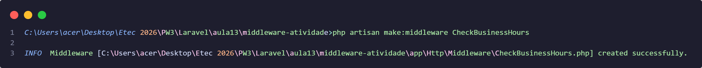
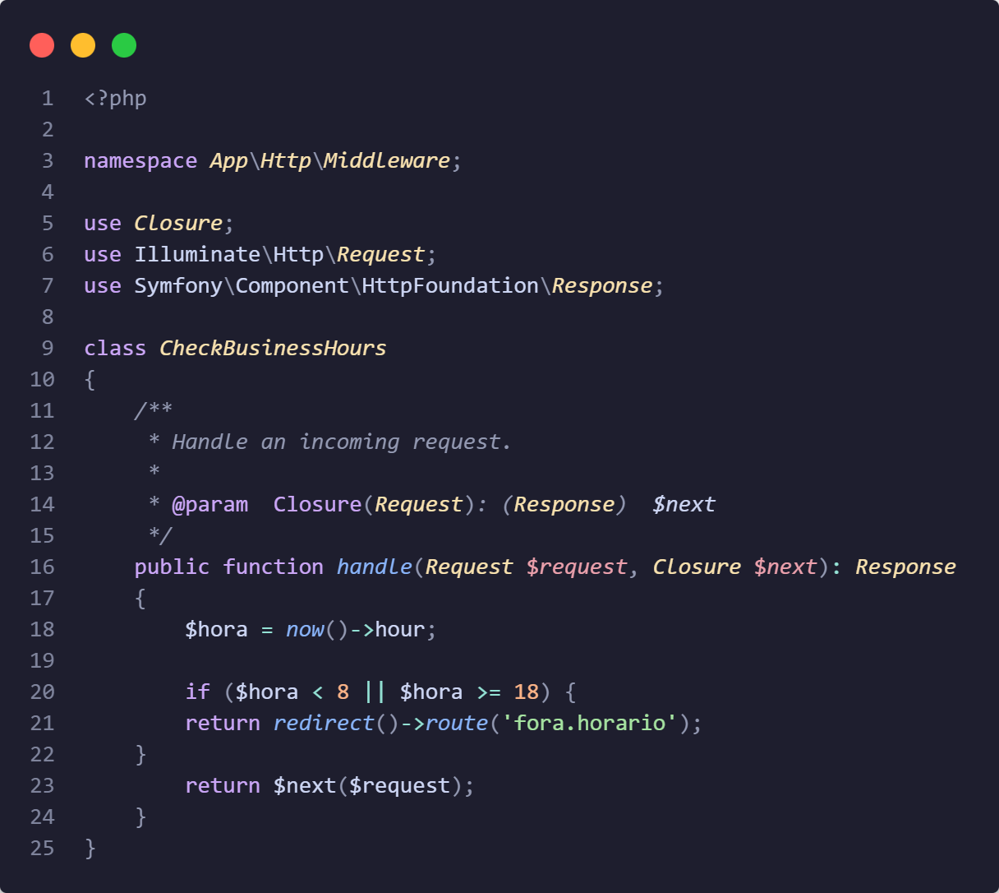
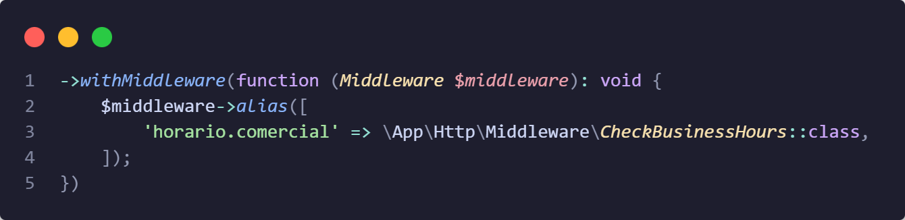
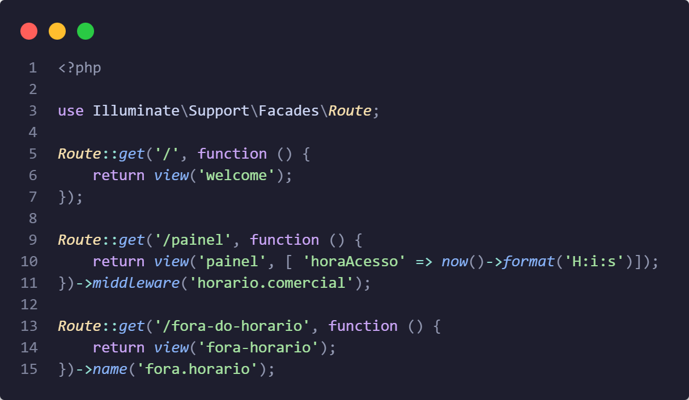
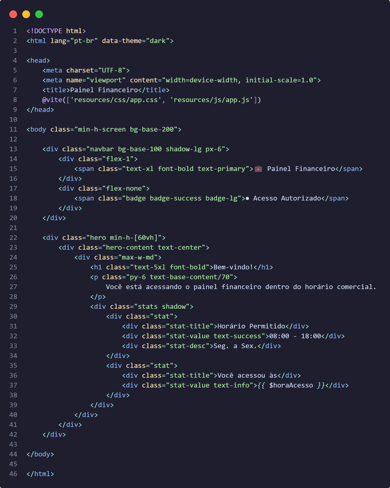
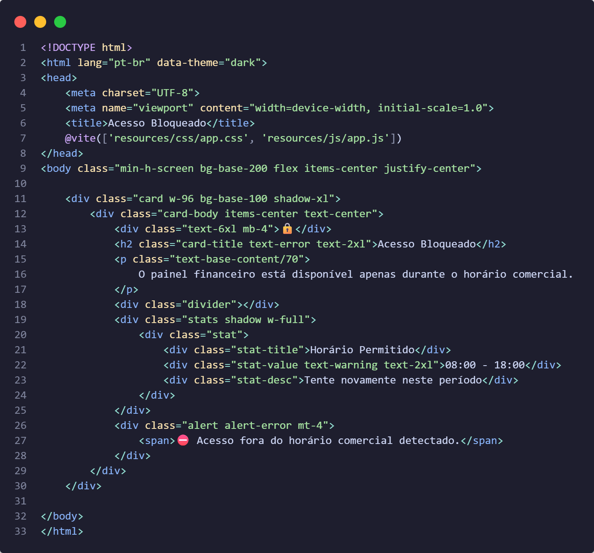
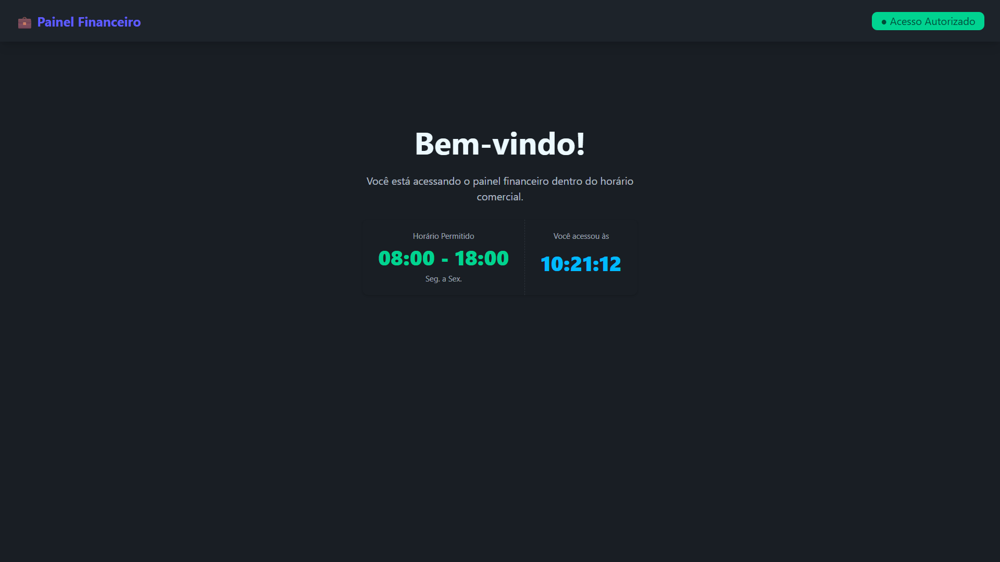
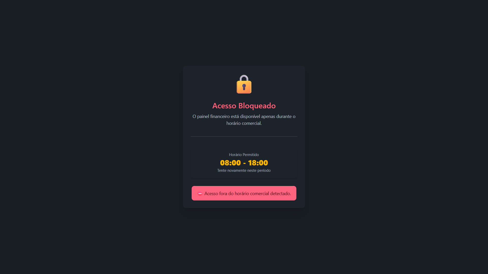

# ATIVIDADE — MIDDLEWARE NO LARAVEL

## Curso Técnico em Desenvolvimento de Sistemas  
### Programação Web III — Grupo B  
### Prof. Salomão Santana do Nascimento  

---

## Aluno
**Wallex André Adriano dos Santos**

---

# Objetivo da Atividade

O objetivo desta atividade foi desenvolver um middleware personalizado no Laravel chamado `CheckBusinessHours`, responsável por restringir o acesso ao painel do sistema fora do horário comercial.

O acesso ao painel é permitido apenas entre **08:00 e 18:00**.

---

# 1. Criação do Projeto Laravel

Foi criado um projeto Laravel utilizando o Laravel Installer.

## Comando utilizado

```bash
laravel new middleware-atividade
```

---

# 2. Criação do Middleware

Foi criado o middleware personalizado chamado `CheckBusinessHours`.

## Comando utilizado

```bash
php artisan make:middleware CheckBusinessHours
```

## Resultado no terminal

```bash
C:\Users\acer\Desktop\Etec 2026\PW3\Laravel\aula13\middleware-atividade>php artisan make:middleware CheckBusinessHours

INFO  Middleware [C:\Users\acer\Desktop\Etec 2026\PW3\Laravel\aula13\middleware-atividade\app\Http\Middleware\CheckBusinessHours.php] created successfully.
```

## Print



---

# 3. Implementação da Lógica do Middleware

No arquivo:

```php
app/Http/Middleware/CheckBusinessHours.php
```

foi implementada a lógica responsável por verificar o horário atual do servidor.

Caso o acesso seja feito antes das 08:00 ou após as 18:00, o usuário é bloqueado.

## Código

```php
<?php

namespace App\Http\Middleware;

use Closure;
use Illuminate\Http\Request;
use Symfony\Component\HttpFoundation\Response;

class CheckBusinessHours
{
    /**
     * Handle an incoming request.
     *
     * @param  Closure(Request): (Response)  $next
     */
    public function handle(Request $request, Closure $next): Response
    {
        $hora = now()->hour;

        if ($hora < 8 || $hora >= 18) {
            return redirect()->route('fora.horario');
        }

        return $next($request);
    }
}
```

## Print



---

# 4. Registro do Middleware

O middleware foi registrado no sistema Laravel para ser utilizado nas rotas protegidas.

## Código

```php
->withMiddleware(function (Middleware $middleware): void {
    $middleware->alias([
        'horario.comercial' => \App\Http\Middleware\CheckBusinessHours::class,
    ]);
})
```

## Print



---

# 5. Configuração das Rotas

O middleware foi aplicado na rota `/painel`.

## Código

```php
<?php

use Illuminate\Support\Facades\Route;

Route::get('/', function () {
    return view('welcome');
});

Route::get('/painel', function () {
    return view('painel', [
        'horaAcesso' => now()->format('H:i:s')
    ]);
})->middleware('horario.comercial');

Route::get('/fora-do-horario', function () {
    return view('fora-horario');
})->name('fora.horario');
```

## Print



---

# 6. Tela do Painel

Foi criada uma view para representar o painel protegido pelo middleware.

## Código

```php
<!DOCTYPE html>
<html lang="pt-br" data-theme="dark">

<head>
    <meta charset="UTF-8">
    <meta name="viewport" content="width=device-width, initial-scale=1.0">
    <title>Painel Financeiro</title>
    @vite(['resources/css/app.css', 'resources/js/app.js'])
</head>

<body class="min-h-screen bg-base-200">

    <div class="navbar bg-base-100 shadow-lg px-6">
        <div class="flex-1">
            <span class="text-xl font-bold text-primary">💼 Painel Financeiro</span>
        </div>
        <div class="flex-none">
            <span class="badge badge-success badge-lg">● Acesso Autorizado</span>
        </div>
    </div>

    <div class="hero min-h-[60vh]">
        <div class="hero-content text-center">
            <div class="max-w-md">
                <h1 class="text-5xl font-bold">Bem-vindo!</h1>
                <p class="py-6 text-base-content/70">
                    Você está acessando o painel financeiro dentro do horário comercial.
                </p>
                <div class="stats shadow">
                    <div class="stat">
                        <div class="stat-title">Horário Permitido</div>
                        <div class="stat-value text-success">08:00 - 18:00</div>
                        <div class="stat-desc">Seg. a Sex.</div>
                    </div>
                    <div class="stat">
                        <div class="stat-title">Você acessou às</div>
                        <div class="stat-value text-info">{{ $horaAcesso }}</div>
                    </div>
                </div>
            </div>
        </div>
    </div>

</body>

</html>
```

## Print



---

# 7. Tela de Bloqueio

Foi criada uma view responsável por informar ao usuário que o sistema está fora do horário comercial.

## Código

```php
<!DOCTYPE html>
<html lang="pt-br" data-theme="dark">
<head>
    <meta charset="UTF-8">
    <meta name="viewport" content="width=device-width, initial-scale=1.0">
    <title>Acesso Bloqueado</title>

    @vite(['resources/css/app.css', 'resources/js/app.js'])
</head>

<body class="min-h-screen bg-base-200 flex items-center justify-center">

    <div class="card w-96 bg-base-100 shadow-xl">
        <div class="card-body items-center text-center">

            <div class="text-6xl mb-4">🔒</div>

            <h2 class="card-title text-error text-2xl">
                Acesso Bloqueado
            </h2>

            <p class="text-base-content/70">
                O painel financeiro está disponível apenas durante o horário comercial.
            </p>

            <div class="divider"></div>

            <div class="stats shadow w-full">
                <div class="stat">
                    <div class="stat-title">
                        Horário Permitido
                    </div>

                    <div class="stat-value text-warning text-2xl">
                        08:00 - 18:00
                    </div>

                    <div class="stat-desc">
                        Tente novamente neste período
                    </div>
                </div>
            </div>

            <div class="alert alert-error mt-4">
                <span>
                    ⛔ Acesso fora do horário comercial detectado.
                </span>
            </div>

        </div>
    </div>

</body>
</html>
```

## Print



---

# 8. Testes Realizados

## Teste 1 — Acesso dentro do horário

### Resultado esperado

- O sistema permite acesso ao painel.

### Print



---

## Teste 2 — Acesso fora do horário

### Resultado esperado

- O usuário é redirecionado para a tela de bloqueio.

### Print



---

# 9. Conclusão

Com esta atividade foi possível compreender o funcionamento dos middlewares no Laravel, especialmente sua aplicação no controle de acesso a rotas.

O middleware desenvolvido demonstrou como é possível aplicar regras de negócio na camada intermediária da aplicação, aumentando a segurança e organização do sistema.